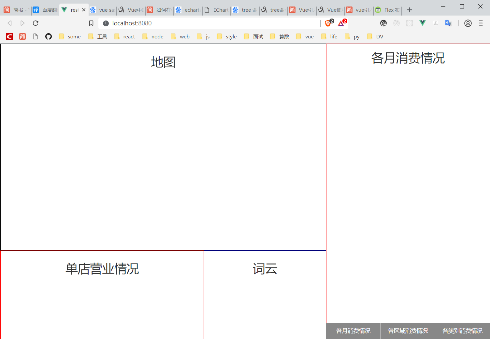

# 针对团购网站餐饮类消费数据的可视分析系统设计与开发
大多数消费者在选择团购网站消费侯后会做出相应评价，从而产生海量的交易数据。这些数据包含了消费者对饮食比较全面的主观性评价和量化评分，因此通过对此类餐饮数据的分析能够有效洞悉城市餐饮消费行为。而由于该类数据体量大、数据类型多等特点，使得传统的数据分析技术已经难以有效进行分析处理。如何将可视分析技术应用于团购网站餐饮类数据分析，探索城市消费行为是一个新颖的研究课题。提供某团购网站绵阳市2015.1.1至2015.11.11期间3623家餐饮类店铺数据的基本信息及30572条评论信息。包含两个数据表：店铺基本信息表和评论属性表。
## 源数据描述
店铺基本信息表中包含：
店铺id、店铺名称、店铺星级、服务评分、口味评分、环境评分、评论数量、店铺地址、店铺类型等。

评论属性表中包含：
评论id、用户id、店铺id、综合评分、口味评分、环境评分、服务评分、评论内容（构建词云、关键词提取）、评论时间、用户名、用户等级等。

## 视图与目标

【地图】 点的大小表示店的综合评价（根据评论数和评分定）

【绵阳各月份消费情况】折线图：餐饮类别为折线条数，x为月份，y为消费数

【针对餐饮类别的区域分布】格格图：分两层，第一层为：餐饮类别，第二层为：区域所占比例

【针对单个区域的餐饮类别】堆叠条形图，y:区域

【单个店铺的运营情况】 柱状图， y值为评论数、颜色随着评论等级变化

【店铺评论词云展示】对评论进行分词然后展示词云

## 项目第一次克隆下来需要运行以下代码以安装依赖
```
npm install
```

### 运行项目
```
npm run serve
```

### Compiles and minifies for production
```
npm run build
```

# 开发文档

## 项目初始化
使用vue-cli3.0构建vue项目
添加sass与sass-loader

### 使用reset.css重置默认样式
因各浏览器的默认样式有一些细节上的差别，这里引用reset.css重置默认css，让项目再各浏览器上表现一致。
使用方法：
再src/assets/styles文件夹下存放reset.css 再src/main.js中使用

### vue-cli3搭建的项目中代理接口名
为了方便前端开发者能够模拟向后台发送数据，在public文件夹下添加 **mock**文件夹，存放mock数据。然后将所有访问**api**路径的请求转发到mock文件夹下。
vue-cli 3.+版本，安装完成之后也找不到config、build等目录。查看官方文档，发现已经被简化成使用vue.config.js来配置项目，可以使用了webpack-chain链式API的调用方式，简化了对webpack配置的修改。

## 数据整理（清洗）
为了让前端使用方便，不需要在页面打开时进行一次数据整理过程。鉴于本课题的数据是固定的，所以将数据整理后再发给前台。
在mock文件夹中创建reorganizeData文件夹，他将处理mock文件夹中的原始数据item.json(餐厅数据) 与 useritem.json(用户评论数据)
在mock/reorganizeData 中 handeldata.js 文件将对数据进行第一次整理。
#### 对餐厅评论数据的处理
源数据格式：(item.json)
```
{
    "item_id":"10535374",
    "name":"廊桥会所",
    "star":3.0,
    "cost":0.0,
    "tast":7.3,
    "environment":7.3,
    "service":7.3,
    "review_count":"2 条点评",
    "item_pic":null,
    "item_info":"咖啡厅 | 御营坝 滨河南路东段14号",
    "item_key_word":null
}
```
处理后数据：(res)
将所有的评论分类, 对象的键名为餐厅id。 在对象中包括各分值的平均分；在details数组中包含了每一条评论的具体评分与时间；review中为所有评论拼接而成的字符串。因为没有好用的npm分词包，我使用python的jieba库来对评论数据进行处理。
```
"2067427": {                //餐厅id
    "avg_rating": 37,       //综合评分平均值
    "avg_tast": 2.5,        //口味评分平均值
    "avg_environment": 2.3, //环境评分平均值
    "avg_service": 2.5,     //服务评分
    "review": "团购点评 很实惠 环境也不错 下次还会来的 团购点评 还行！比较适合两个人聊天，比较安静 还行吧，算绵阳比较好的，我确实不怎么喜欢。环境还蛮好，牛排真........",
    "details": [
      {
        "times": "07-23",
        "rating": 50,
        "tast": 4,
        "environment": 4,
        "service": 4
      },
      //................
    // 评论细节
    ]
  },
```


## 页面布局

1. 在src/compoents/下创建页面所需的组件。
   一个组件一个文件夹，文件夹中index.vue向外暴露组件，并且每个文件夹下有README.MD文件, 方便队友写文档
```
    ├─Blocks           方块分割图
    ├─CategoryStack    堆叠条形图
    ├─CiYun            评价词云
    ├─ConsumeTend      消费趋势
    ├─Map              地图
    └─RestaurantDetail 餐厅细节
```
2. 在App.vue中进行布局
   